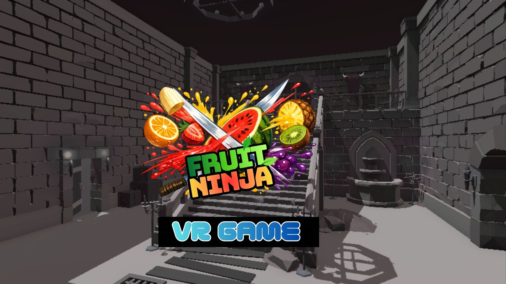

# 🥽 VR Multiplayer Game — Fruit Ninja

> A multiplayer Virtual Reality game built with Unity, Meta Quest, and Unity Netcode - developed as part of the Virtual Reality course as a Final Project.


---

## 🎮 About The Project

This VR multiplayer game was developed as a practical project for the **Virtual Reality Lab Course** at Bauhaus-University Weimar (WS 2025/26). Players inhabit a shared virtual dungeon environment where they can navigate, interact with objects, and compete in a fruit-slashing mini-game using VR controllers.

The project explores core VR interaction paradigms including navigation, manipulation, and real-time multiplayer synchronization using Unity's Netcode for GameObjects.
## 🎬 Demo
▶ Click to watch the demo
https://github.com/KirtiThakur1/VR-Multiplayer-Game-Project/blob/main/Demo-Video_compressed.mp4

## 🛠️ Built With

| Technology | Purpose |
|---|---|
| Unity 2022.x | Game Engine |
| Meta Quest 2/3 | VR Hardware |
| Unity Netcode for GameObjects | Multiplayer Networking |
| Unity Relay & Lobby Services | Matchmaking |
| XR Interaction Toolkit | VR Interactions |
| VRSYS Core Package | VR Framework (Bauhaus-University) |
| ParrelSync | Local Multiplayer Testing |
| Git & GitHub | Version Control |

---

## ✨ Features

### 🧭 Navigation
- **Continuous Steering** — trigger-based forward movement with ground following using Physics.Raycast
- **Teleportation** — thumbstick-based three-phase teleport (Aim → Lock → Execute)
- **FOV Vignette** — speed-based field of view restriction to reduce motion sickness
- **Stair Climbing** — dynamic ground following adapts to uneven terrain

### 🖐️ Manipulation
- **Virtual Hand (XRDirectInteractor)** — close-range grab by physically touching objects
- **Ray Interaction (XRRayInteractor)** — long-range grab by pointing a ray at objects
- **GoGo Technique** — non-linear arm extension for reaching distant objects while reducing lever arm effect
- **Networked Grab Policy** — prevents two users from grabbing the same object simultaneously with ownership transfer

### 🌐 Multiplayer
- **Unity Relay & Lobby** — cloud-based matchmaking, no port forwarding needed
- **Real-time Avatar Sync** — player positions, rotations and animations synchronized
- **Teleport Preview Sync** — other players can see your teleport preview in real time
- **Networked Object Ownership** — grab objects and own their physics across the network

### 🎯 Gameplay
- **Fruit Slashing Mini-game** — slash spawning fruits with your axe weapon
- **Score System** — track and display points per player
- **End Game UI** — winner announcement and final scores

---

## 🏁 Milestones

### ✅ Milestone 1 — Project Setup
- Unity project initialized with VRSYS Core package
- Meta Quest integration via XR Plugin Management
- Git repository setup with branching strategy (KirtiDev / FarnazDev)
- Basic scene setup with dungeon environment

### ✅ Milestone 2 — Navigation
- Implemented `ExtendedSteeringNavigation.cs` with:
  - Trigger-based continuous movement
  - Ground following with Physics.Raycast
  - FOV restriction vignette
- Integrated `ThumbstickNavigation.cs` for teleportation
- Networked teleport preview via `TeleportPreviewSerializer.cs`
- NetworkTransforms on teleport visual components
- Two-HMD multiplayer testing via Unity Relay

### 🔄 Milestone 3 — Manipulation (In Progress)
- XRDirectInteractor (virtual hand) setup
- XRRayInteractor (ray grab) setup
- GoGo technique implementation (`GoGo.cs`)
- Networked grab policy with ownership transfer (`GrabPolicy.cs`)

---

## 🚀 Getting Started

### Prerequisites
- Unity 2022.x or later
- Meta Quest 2 or 3 headset
- Meta Quest Developer Hub or Meta Quest Link app
- Android Build Support module installed in Unity

---

## 🌐 Multiplayer Setup

### Two-HMD Testing (Same WiFi)
```
1. Both players on same WiFi network
2. Player 1 (Host): Hit Play → Click "Create Lobby"
3. Player 2 (Client): Hit Play → Find lobby in list → Click "Join"
4. Both players spawn in dungeon scene
```

### Local Testing with ParrelSync
```
1. Install ParrelSync: Window → ParrelSync → Clones Manager
2. Add Clone → Open in new Unity Editor
3. Clone: disable XR (Project Settings → XR Plug-in Management → uncheck)
4. Original: Play as Host | Clone: Play as Client
5. Add scene to Build Settings in BOTH editors
```

### Network Configuration
- Uses **Unity Relay Service** — no IP address or port forwarding needed
- Lobby auto-discovery built in
- Max players: configurable in `LobbySettings` on ConnectionManager

---

## 📁 Project Structure

```
Assets/
├── VR Lab Class/
│   ├── Scripts/
│   │   ├── Milestone 2/
│   │   │   ├── ExtendedSteeringNavigation.cs   ← continuous movement
│   │   │   └── TeleportPreviewSerializer.cs    ← networked teleport sync
│   │   └── Milestone 3/
│   │       ├── GoGo.cs                         ← GoGo arm extension
│   │       ├── GrabPolicy.cs                   ← networked grab access
│   │       └── NetworkXRGrabInteractable.cs    ← networked grab component
│   ├── Prefabs/
│   │   ├── LabClass-HMDUserPrefab              ← Milestone 3 user prefab
│   │   └── HMDUserPrefab                       ← Main multiplayer user prefab
│   └── Input Actions/
│       └── VR Lab Class Input Actions.asset    ← controller bindings
├── Setup-and-Demo/
│   └── Scripts/
│       └── ClientTypeDetector.cs               ← Host/Client role detection
└── Scenes/
    ├── VRSYS-SingleScene                        ← Main multiplayer scene
    └── LowPolyDungeons_Demo                    ← Dungeon environment
```

---

**Course:** Virtual Reality  
**University:** Bauhaus-University Weimar  
**Supervisors:** Tony Zoeppig, Karoline Brehm

---

## 🙏 Acknowledgements

- [VRSYS Core Package](https://www.uni-weimar.de/) — Virtual Reality and Visualization Group, Bauhaus-University Weimar
- [Unity XR Interaction Toolkit](https://docs.unity3d.com/Packages/com.unity.xr.interaction.toolkit@latest)
- [Unity Netcode for GameObjects](https://docs-multiplayer.unity3d.com/)
- [Meta Quest Developer Documentation](https://developer.oculus.com/)
- Poupyrev et al. (1996) — *The Go-Go Interaction Technique: Non-linear Mapping for Direct Manipulation in VR*

---

> 📅 Project Period: October 2025 — March 2026  
> 🎓 Bauhaus-University Weimar, WS 2025/26
